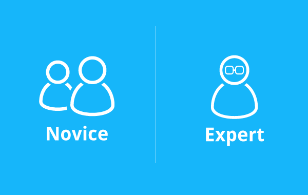
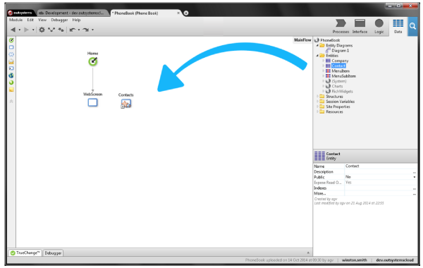
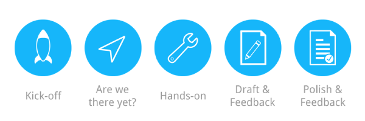
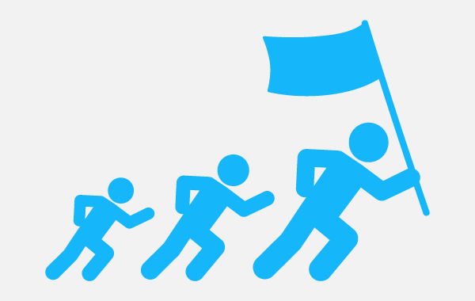

# User Story Driven Docs

At OutSystems we create a platform that makes it easy to manage the whole application lifecycle management process. Nonetheless, our documentation wasn't that easy for our users.

We focused on describing each button available on the UI (User Interface), and not on the user intentions and goals.

A clear example of this, was that we had a full documentation page for the find text feature (CTRL+F). It described in excruciating detail every option available on the UI:
 - Case sensitive, case insensitive;
 - Only match whole word;
 - Refine the search scope. 

We focused on documenting these self-explanatory options, but didn't told our users how they could find what they need:
 - How to find all elements with a given name;
 - How to find all CSS rules affecting the headings;
 - How to find all queries to a specific database table.

For us it was difficult to maintain the documentation. OutSystems Platform was constantly changing, and we couldn't keep up with the pace.

More importantly, we weren't meeting the user needs. And that was clear from pages with a single-digit page views, and from the feedback we got from some of our customers.

In this article I'll tell you the how we stopped trying to document the UI, and started delivering user story driven documentation.

We now focus on what our users want to achieve and how they can achieve it, independently of how many windows or buttons they need to go through.
We're also able to better prioritize our work, so that the most frequent user stories get more attention and resources.

I'll cover:
 - Why you should avoid documenting the UI;
 - How you can check if you're currently documenting the UI; 
 - Why users stories might be better a better way to document a product;
 - How focusing on user stories changed our team's culture, and allowed us to work on what really matters.

So let's get down to it.

## Why Avoid Documenting the UI

It's easy to see how documenting the UI might make it more difficult for your users to understand your product. But it's not that easy to understand that doing so might also be bad for you and your team.

So first let's focus on the impact for your users, and then explore some of the consequences for you and your team.

If you're documenting the UI, even if your users find the right documentation, it won't have all the context they need to complete a task.

This will make it difficult for both:
 - **Novice users** - they won't understand how concepts relate to one another, and how to combine tools to solve a problem;
 - **Expert users** - they'll have trouble finding reference documentation so they need to rely on experimentation.
	

		
### Life Will Be Difficult for Novice Users

Finding something with CRTL+F is pretty straightforward, but most tasks like querying a database table, require knowing about several concepts, and how they relate to one another.
		
As a consequence, simple tasks will seem daunting for first-time and novice users. In our case, we had around 13 documentation pages that explained how to query a database table. Even if a novice user was patient and read all this documentation, it was still difficult to get a sense of how to fetch data. 

More importantly it was difficult to understand how to combine the tools needed to display the result of a query on a page.

Given that OutSystems has a visual development environment, this really frustrated me. It frustrated me because to query data and display it on a screen you only need three drag and drops and two extra mouse clicks.
Oh, and you only need all this trouble if you're doing it the hard way. Otherwise, a single drag and drop suffices.

### Life Will Be Difficult for Expert Users

And life won't be easier for your expert users.
When you're focused on documenting the UI, it's difficult to separate which information should be structured into a user guide, and which should be reference. Everything feels like reference to you.

You'll end up mixing everything together, which makes it harder for seasoned users to find that nifty detail they're looking for.

### It Will Be Difficult to Drive Traffic to Your Documentation

Even if you write documentation that accommodates novices and experts, all your effort will be in vain if your users can't reach what you've documented.

Because, when you're documenting the UI, the content and title of your documentation reflects:
 - The name you gave to the feature;
 - The title or name of a window;
 - The label of a button.

And that might not be the best choice for SEO (Search Engine Optimization).

In our case, we called the documentation page for the find feature "Find Tool". And it only described what users could learn just by looking at the interface. So for our users this page was of little or no value.
			
And for other documentation pages, things weren't looking much better. Since the content didn't match the user needs, it ended not having the keywords users searched for.
Because when you're focused on documenting the UI, your documentation won't have the keywords your users are searching for.
So search engines won't rank your documentation pages high enough for your users to find them.

And for situations where your documentation ranks higher, it might not matter if you have a bad page title.
Search engines display your page title as part of the search result. If the page title doesn't match the user's mental model, they might not click the link that leads them back to your documentation.

### Life Won't Be Easier for You and Your Team

When you're documenting the UI, every task, window, and  button has the same importance to you.

When everything has the same importance, it's difficult to prioritize your work. This is critical, specially when you're running towards a milestone.
As a side effect you'll have an hard time accepting that it's OK not to document tasks that are trivial to execute.

When a feature is slightly changed, like a slight change in the button label or its position on the UI, you'll feel like rushing to update the docs.
I'm not arguing that you should let the documentation rot. But for us this meant that we had a never-ending maintenance backlog.

This whole recipe makes it harder for a team to think strategically. Soon you'll be more focused on internal processes and trying to decrease a maintenance backlog, than on working on what matters for your users.

## How to Check If You're Documenting the UI

The major problem is that no customer or stakeholder can tell you directly that you're documenting the UI. This makes it harder for you to pinpoint if something isn't working, and what you should do to address it.

But from our experience, there are a few tell-tale signs that might indicate you're documenting the UI:
 - Your customers complain that they can't connect the dots, or have a birds-eye view of how to orchestrate the several tools available;
 - Every piece of documentation feels like reference;
 - Lots of documentation pages state the same but with slight variations;
 - Some pages have consistently low page views or low average reading times, and you don't have a clue on how to improve that;
 - You have a huge maintenance backlog that its is stopping you from thinking strategically.

We had all the symptoms above, but didn't know what could be done to address them. We thought all these problems were separate, and could be addressed with individual solutions.

## How We've Started Changing

Finding that we were documenting the UI, and figuring out what we could do, was a long road. Let me tell you just a bit of what we went through as we tried to change our processes and the way we document OutSystems Platform.

### May 2012

Around May 2012 we launched a new lifecycle management tool as part of our platform. But this time, we addressed this documentation project with a different mind set.

We sat met with the development teams, product management, support, and gathered the user stories the tool addressed. We identified around 18 use cases, but only 12 were critical.
The other six were slight variations of the main use cases, or edge cases that the tool didn't address well.

What we've started noticing was that it was easy to prioritize this project. Since user stories built on top of one another, the order on which we should tackle things came quite naturally.
As we marched to the deadline, we started feeling comfortable on postponing low priority user stories. If there were more important issues to address, we could ship the remaining documentation after the product release.

We were also comfortable on not document them at all, and wait for feedback from our users.

And then we backtracked a bit.  Our team had some internal changes, and we started designing a new online training.
This was a big project and we needed to allocate most resources to that project. So during that period we couldn't make major changes to the documentation.

### May 2014

We were marching for another major release. After being frustrated for a while and seeing we could deliver better documentation, I shared with our team some documentation projects I think are amazing.

I showed that we could be doing much better, we just needed to commit to it.

But I knew this wasn't enough to change the way we delivered documentation. So I also showed the team how I'd written almost all documentation for one of the major features we were launching. 
Instead of trying to document the UI, I wrote that documentation with user stories only.

With that nudge, we all agreed to document the rest of the flagship features with user stories.
But we hadn't created any process or style guides to ensure we all delivered user stories. So some smaller features still got documented in a mix of user story and UI.

###	October 2014

We released the version we started working on May and we were all exhausted.

We decided that we needed to stop and do a team retrospective. Each team member prepared a 20-minute presentation about the projects they had worked on during the six months leading to the release.
For each project the team member also needed to point out three things that went well and three things that could be improved.

[I've wrote about that retrospective in detail](http://www.joaofn.com/post/outsystems-platform-a-retrospective/), but overall we concluded that with user stories we were:
 - Able to deliver documentation before reaching the Beta milestone;
 - Definitely improving over our existing documentation;
 - More productive, since it was easier to prioritize work;
 
Focusing on user stories also made discussions between our team and development teams focused and easier overall.

We just needed to structure the way we tackled projects, because each team member had her own process. Having structure would make project management easier, and save us time on future projects.

## Our Current Documentation Process

After that retrospective we agreed on using and iterating this five-step process:
 - Start early and follow-up often with the teams;
 - Check if it's the right time to start creating documentation and training materials;
 - Get your hands-on and test the new feature;
 - Write a documentation draft and ask stakeholders for feedback;
 - Polish the documentation and ask feedback, if needed.

### Start Early and Follow-Up Often

At OutSystems, the development teams host a project kick-off meeting before starting a project.
Every team invites us and other stakeholders, so that we know what each team is doing.

We then analyze the user stories gathered by the team, and check the design documents they produced.
If we don't agree with a user story, we review it with the development team and product management to ensure that we only ship the most relevant user stories.

### Find the Right Timing to Start Documenting

Since most development teams follow a mix of SCRUM and Kanban, they also demo the new developments after each sprint. These touch points allow us to evaluate how much the team has progressed, and check if it makes sense to start documenting and producing training materials for that new feature.

The timing must be right. If we tackle a project too soon, we end up documenting features that are prone to change.
If we tackle the project too late, we risk shipping documentation late.
More importantly, we risk not being able to give feedback to the development teams that might make the feature for our users.

### Test-Drive the New Feature and Give Feedback

When we think the timing is right, we get a build from the development team and try to execute the user stories with the new features.

We implement some proofs of concept just to try and understand the best story to tell in the documentation. For example, should the documentation about fetching data from the database focus on fetching customers, orders, tickets, or something else?

After we've gathered some experience with the new feature, we also share our feedback with the development teams. This allows us to pinpoint situations that make it harder to learn and use the new feature.
For instance, identify that it's not intuitive how to query data from multiple tables, understand what a specific property is used for, or understand what an error message is trying to convey.

### Create a Documentation Draft

We then start drafting the documentation for the new feature. We usually use a collaborative writing tool like Google Docs, and avoid using markup, screenshots, or anything else that distracts us from the user story we are trying to explain.

A round of "20%" feedback is followed within our team and the development team that implemented the feature.
The goal of this feedback round is to validate if we've nailed the user story and the example we're using to explain it.

### Polish the Documentation

Finally, after we've all agreed that the user story makes sense and we've got a good narrative, we review and polish the documentation.
We do some editorial work and add the necessary screenshots to ensure users get all the context they need.

An "80%" round of feedback follows. At this point, the technical details are also pinned down, so the feedback is on ensuring the documentation is compelling, easy to read, and that it properly explains how to accomplish a relevant user story.

## What We've Learned From This Journey

Since 2012 we've learned a couple of important lessons.

**Start small**. Take new and smaller projects as opportunities to start changing.

It's easier to convince others to follow you, if you've got something to show.
With the first documentation project we've done back in 2012, we were able to show some positive results, but this didn't create the awareness we needed to make us change.

**Don't wait for major projects to start changing**. After finishing the documentation for the application lifecycle management tool, I was hopping that we get a project to revamp our most used docs. The docs for our IDE.
But there are always things getting in the way. So if you really want to change, start with the new features you're documenting you're shipping.
Then your changes will get some visibility and momentum, and other things getting in the way will seem less important.

**Someone needs to lead the change**.  If you're frustrated with something don't just complain, do something.

	
Personally I was frustrated with:
 - Documentation that didn't show how powerful and easy the OutSystems Platform is;
 - Documentation that didn't help users connect the dots;
 - An ever growing maintenance backlog that was stopping us from thinking strategically;
	
I saw how user stories could help address all these issues, so I documented a flagship feature with user stories.
At the beginning, the feedback I got within the team was mostly about being inconsistent.
But after a while the feedback started changing, and now documenting by user stories is the status quo.

**Users Stories make us better developer advocates**.
After you've identified the user stories, you can leave your gut feelings aside when giving feedback to others.

User stories that are executed frequently should be easy and straightforward to accomplish, for example querying data from the database.
User stories that are not so frequent can be more difficult and hidden, for example check the SQL that was generated by OutSystems Platform for fetching data.

If the development team implemented something but there's no user story for it, maybe it's just bloatware and your product is better off without it.
Just this year we were able to convince the development teams to drop two features that would otherwise be included on the product but wouldn't be of use to 99% of our customers.

## This is Only the Beginning

So far we only had experience creating user story driven documentation for the more visual parts of our product.
There is still much to learn and iterate.

Maybe it makes sense to use the same approach for documenting frameworks, APIs, and other low-level aspects of the development tools.
Or maybe user story driven documentation won't work at all in these situations.

Maybe there's something better than user stories, that we are yet to find out.

